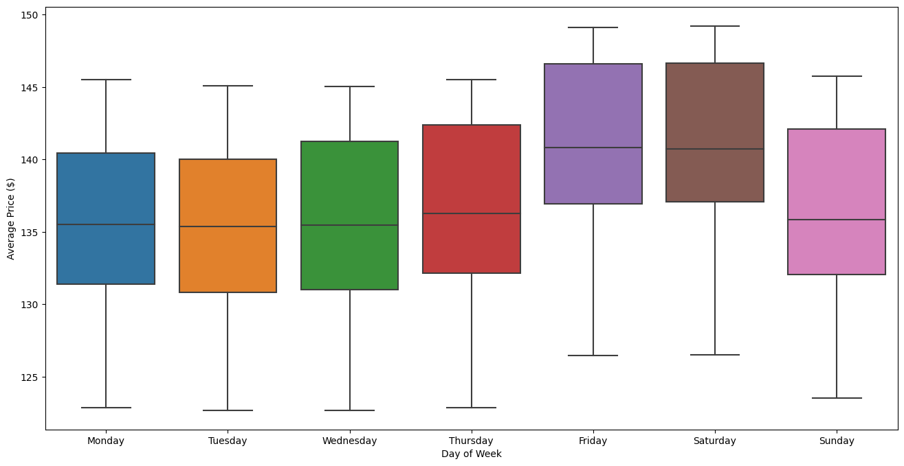

# Udacity Data science nanodegree - Data science blog post
This repository houses the data files, code and analysis used to write a blog post on Airbnb data from Seattle for 2016. The project comes with a blog post: [Your next cheap homestay in Seattle](https://medium.com/@wibo_31727/your-next-cheap-homestay-in-seattle-1461442d8208)

### Requirements to run the project
The project runs on python 3.8 or later and expects Jupyter notebooks with the correct python version kernel installed. The libraries used in the project are listed in the `requirements.txt` file and can be easily installed running `pip install -r requirements.txt` from the project directory.

## Motivation for the project
The project was picked from a list of possible projects provided by Udacity. A large chunk of the work for a data scientist consists of collecting and cleaning data for us, using one of the suggested projects cuts back heavily on the data collection time required, leaving more room to focus on the practicing the concepts explained during the lessons.

The Airbnb project was picked as it is an interesting data set with potential for follow up side projects using more recent data. Airbnb is an interesting company as they provide a way to rent out your property when you are not using it benefitting both the owner and the renter while doing so. The impact the company has on the city image, with whole neighbourhoods being bought up and rented out, is a very interesting effect. This project looks like n excellent starting point to learn more on the data while also putting in practice the lessons from the first module. 

### Questions to answer
The data set as of writing is 5 years old and the conclusions drawn here might not be applicable to the short stay rental market 2021 onward, especially as regulation of Airbnb type renting is ever increasing. That said, lets have a look at the price trends and which factors influence the listing price for a short stay rental.

- What is the average base listing price for a property in Seattle?
- Does the location of the property in the city influence the price?
- What are the temporal effects on the listing price?
	- Does the time of year have a large effect when visiting Seattle?
	- Does the price increase for the holidays?
	- Seeing as short stays are more likely to happen in the weekend, does this reflect in the price?
- What features of a property has the largest influence on the price?


## Data
### Files in the repository
The project has a flat structure, with `assets` holding all the images and generated graphs used in the blog post. The dataset is available in `data/seatle` where
-  `calendar.csv` describes booked nights for the listings between April 1st 2016 through January 2nd 2017
- `listings.csv` has the base pricing, location and amenities information on the properties
- `reviews.csv` contains reviews written by guest of the properties

The full exploration of the data, feature engineering and training of a Randomforest regressor is described in `Exploratory data analysis - Airbnb Seattle listings, reviews and availability.ipynb`.

During the project I also explored linear regression, recursive feature elimination (RFE) and K-nearest neighbours as additional regressors to estimate the price of a listing. The code snippets for this are in `Extra linear regression and KNN - Airbnb Seattle listings.ipynb`

```bash
├── assets
│   ├── average_price_weekday.png
│   ├── ...
│   └── top_7_features.png
├── data
│   └── airbnb_seatle
│       ├── calendar.csv
│       ├── listings.csv
│       └── reviews.csv
├── Exploratory data analysis - Airbnb Seattle listings, reviews and availability.ipynb
├── Extra linear regression and KNN - Airbnb Seattle listings.ipynb
├── README.md
└── requirements.txt
```

### Exploratory data analysis
See the analysis plan for more detailed steps taken. The main goal of going through the data files was to identify usability and cleaning required. After an initial look it turned out the `reviews` data needed language processing to extract some additional information, as NLP is out of scope for this exercise I decided to not use this file in the final analysis. This was supported by the `review score` columns in the listings data, giving an average impression from the reviews data.

There are 3818 listed properties in the `listings` dataset, including both information on the actual accommodation and the area it is located in. For almost all of these the availability per per day is listed between April 1st 2016 and January 2nd 2017, spanning 8 full months and 1.39 million lines of calendar data.

The price distribution for can be shown below, the average price for a night away is ~$128 with a median price of $100 and a standard deviation of $90.25. 50% of the properties are priced between $75 and $150 per night. Here we can already answer the first question:
> What is the average base listing price for a property in Seattle?  

The average is ~$128 for a night away


#### Analysis plan
1. Go through `calendar`, `listings` and `reviews` data and identify columns of interest, missing values distributions and if the said file is needed to answer the questions
2. Clean & enrich data by:
	3. Changing data types
		4. Recoding boolean values to 1-0 to make it easier for the regressor to handle
		5. Cleaning string representation of the prices (remove dollar-signs and commas)
		6. Change date columns from string to date type
	4. Imputing missing values, or decide to drop column when missing data has to much information
		5. Some manual imputation done here to extract information from a small number of records
	5. Enrich data by creating higher level categories for the type of property, add pricing categories for quick eye ball analysis on impact of features
3. Combine `listings` and `calendar` information for further data analysis

#### Property_type grouping
The `listings` property type had a wide range of possible values, staring with House or Apartment but also having support for things like Boat or Yurt. The distribution, shown below, for some of these was very low and cut heavily into the information density of the property. Additionally, you could argue a Townhouse, is another form of house. The alleviate this issue a new feature was added, the `property_category` to capture the two main categories of property, House and Apartment, and assigning the rest into a Other category. This shows that over 90% of the properties listed belong either to House or Apartment, see image below.

|                 |   property_type |   property_type_percentage |
|:----------------|----------------:|---------------------------:|
| House           |         1734.00 |                      45.42 |
| Apartment       |         1708.00 |                      44.74 |
| Townhouse       |          118.00 |                       3.09 |
| Condominium     |           91.00 |                       2.38 |
| Loft            |           40.00 |                       1.05 |
| Bed & Breakfast |           37.00 |                       0.97 |
| Other           |           22.00 |                       0.58 |
| Cabin           |           21.00 |                       0.55 |
| Bungalow        |           13.00 |                       0.34 |
| Camper/RV       |           13.00 |                       0.34 |
| Boat            |            8.00 |                       0.21 |
| Tent            |            5.00 |                       0.13 |
| Treehouse       |            3.00 |                       0.08 |
| Chalet          |            2.00 |                       0.05 |
| Dorm            |            2.00 |                       0.05 |
| Yurt            |            1.00 |                       0.03 |


## Results of analysis

### Influence of location on price

> Does the location of the property in the city influence the price?

In short yes, the location influences the price. The graph below show the distribution of the price per neighbourhood and is coloured per neighbourhood group. Overall, Downtown is the most expensive area with a relatively narrow price spread, where the Ballard neighbourhood group is the cheapest, again with a narrow spread. The Magnolia area has the widest spread among the different neighbourhoods within that area.


### Seasonal trends
Looking at the properties pricing and how these change over time tell us something about the seasonality of the price. Taking the 7-day rolling window for the price in the `calendar` data shows the below graph.
> What are the temporal effects on the listing price?:
>> Does the time of year have a large effect when visiting Seattle?
>> Does the price increase for the holidays?


Here you can clearly see a increasing price with the spring through the summer before dropping down a bit in autumn. There is a small spike in the pricing at the end of the year, right around the Christmas time, indicating the holidays have an effect on the pricing as well. A 7-day rolling window was used here to alleviate the effect of the weekly trend (see below)

> What are the temporal effects on the listing price?:
>> Seeing as short stays are more likely to happen in the weekend, does this reflect in the price?



Looking at the weekly distribution of prices over the year show that the prices start going up on Thursday, rising through to Sunday before dropping back to the lowest level on Tuesday. Given that people are more likely to book a short stay over the weekend, one could conclude the market responds to the increased demand in short stay properties.

## Regression & feature importance
Up till now we have seen some effects of individual features like weekday or location, on the property listing price. The missing information is which properties have the largest influence on the price.
> What features of a property has the largest influence on the price?

To answer this question we will be looking at just the `listing` data first. The seasonal trends from the `calendar` are discussed under the [Seasonal trends](seasonal-trends) section. 

### Feature engineering 

Before training the model we'll have a look at the features we currently have. After missing value imputation on the original data the following steps where taken to remove or enrich features in the `listings` data.

**Identifying columns to remove**

-   **High percentage missing values**
    -   Features having over 30% missing values will be dropped. The imputation in these cases are hard and lead to less divers data, this masks a potential pattern in the data (see the **only one value**).
-   **Unique**
    -   Columns like  `id`, describing the listing identifier, do not provide general information to be used in the regressor. Being unique they don't contribute to explaining the variance of the data thus they do not add to the performance of the regressor.
    -   Features like  `space`  are free text fields, language processing is required to extract more information from this field. In its current raw form it will be dropped as it doesn't add anything to the regressor. Everything with a higher variance of 10% in the features will be dropped
-   **Only one value**
    -   Similar to the unique values, columns with only one value do not enrich the regressor with information about the listings. These include fields like  `scrape_id`

**Change boolean columns to int**  
The following columns are actually boolean columns, changing the data type to a numeric type like int will eliminate the need to introduce dummy variables for these, reducing the number of features without impacting the information density of the data set.

-   `instant_bookable`
-   `require_guest_profile_picture`
-   `require_guest_phone_verification`

**remap  `calendar_updated`  columns**  The  `calendar_updated`  column tells us something on the amount of time passed since the listing was last updated. As we saw from the plots above, time has a big influence on the price. As its currently provided the column has a lot of different values which spreads out the core information we are interested in. We will map the values to 4 categories:

-   updated this week
-   updated this month
-   updated last 6 months
-   updated over 6 months ago

`host_verfifications`  was dropped as a nested field.

### Random forest regressor
For the regression a random forest was chosen as it comes with built-in feature importance capabilities. The data was split in a training and testing set, in a 80/20 split. The regressor was trained on the training data and performance was evaluated on the test set using both the r2 score and the Mean Absolute Error (MAE). The MAE was picked here as a good error message as it resonates clearly when talking about prices. As we have both the IQR ($75-150) and the standard deviation ($90.25) we can get a good grasp on how well the model is performing and more importantly relay this information to interested readers.
- r2 score: 0.6438 
- MAE: $33.28

The performance of the regressor is ok when taking into account the wide price range and the small MAE. Eliminating additional features from the set reduced the performance of the regressor.

#### Feature importance
After training the regressor we can use the random forest build in feature ranking to rank the most important feature and answer 
> What features of a property has the largest influence on the price?


There are 3 main groups that influence the price:
1. size of the property, how many can it accommodate (in blue)
2. Availability over the the year (in orange)
3. Reviews (in green)

The neighbourhood, room type, how many properties a host has listed and the cancellation policy matter a lot less.

## Conclusion
Want to stay cheap in Seattle using Airbnb? Visit in early spring at the start of the week in the lake city district in a small property. In this analysis we saw that the price of a property is strongly influenced by the time of year and the size of the property in terms of how many people it can host.

## Acknowledgements

- Blog post: [Your next cheap homestay in Seattle](https://medium.com/@wibo_31727/your-next-cheap-homestay-in-seattle-1461442d8208)
- Data source: [Kaggle Airbnb seattle 2016 data](https://www.kaggle.com/airbnb/seattle/data)